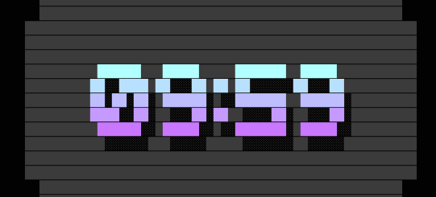

<p align="center">
  <br><h1></h1>

[](https://github.com/swartzrock/pace/releases/latest)
[](https://github.com/swartzrock/pace/actions/workflows/yarn-test.yml)
[](https://github.com/swartzrock/pace/blob/main/LICENSE)
[](https://www.typescriptlang.org/)
[](https://github.com/swartzrock/pace/issues)

<p align="center">Typescript app with multiple visual countdown timers</p>

<p align="center">
  <a href="#about-pace">About Pace</a> •
  <a href="#how-do-I-install-pace">Installation</a> •
  <a href="#usage">Usage</a> •
  <a href="#contributing">Contributing</a> •
  <a href="#faq">FAQ</a>
</p>

<p align="center">
	

</p>

## About Pace
Pace is a Typescript app that performs a countdown timer using a visual renderer on the command line. 
Choose a renderer when you run the app, or run preview to see a representation of all the renderers.

## How do I install Pace?

### Install Pace With Homebrew

If you're on macOS use [Homebrew](brew.sh) to install the latest `pace`. 

```shell
brew install swartzrock/tap/pace
```

Run `brew upgrade` to keep up to date with the latest version.

### Download A Release

See the [Pace Releases](https://github.com/swartzrock/pace/releases) page for the latest macOS (ARM and Intel), Windows (Intel), and Linux (Intel) binaries.

### Build The Native Executables

You can build the releases yourself by cloning the repository and running the `pkg` command. Requires `yarn`. 

```shell
git clone git@github.com:swartzrock/pace.git && cd pace && yarn
yarn pkg
```

### Run with Node

You can run the Typescript version yourself by cloning the repository and running the dev command. Requires `yarn`.

```shell
git clone git@github.com:swartzrock/pace.git && cd pace && yarn
# The bin/dev command runs the Typescript code directly. 
bin/dev 2m shuffle
```


## Usage
```sh
USAGE
  $ pace [DURATION] [RENDERER]

ARGUMENTS
  DURATION  duration in (m)inutes and (s)seconds (eg 3m10s = 190 seconds)
  RENDERER  the timer renderer:
            bar, bigtext, circles, colorwheel, colossal, pie, renderers, shuffle, slant, sweep

DESCRIPTION
  Displays a progress timer

EXAMPLES
  $ pace 5m pie
```


### The Shuffle Renderer


Use `shuffle` to preview all renderers in action. This renderer switches to another renderer every 10 seconds.

```sh 
bin/dev 5m shuffle
```


### Preview All Renderers
```sh 
bin/dev tools preview
```


## Contributing
It would be great to see more renderers! To write a new renderer add a subclass of `src/renderers/TimerRenderer` and register it with
a short name in `src/renderers/AllRenderers`. 

### Preview All Available Colors and Gradients
```sh 
bin/dev tools colorblocks
```

 

### Preview All Available Figlet Fonts
```sh 
bin/dev tools allfonts
```

## FAQ

### How did you build Pace?

Pace is written in Typescript using the [oclif](https://oclif.io/) CLI framework, packaged with Yarn, and compiled as native executables with [pkg](https://github.com/vercel/pkg) .

### I'm seeing horizontal lines when I run Pace



If you see horizontal lines across the screen when you run Pace, you may need to reduce the line height of your Terminal font. If you're using macOS's Terminal.app, you can edit the Font in Settings and choose a smaller line height, eg 0.85.

