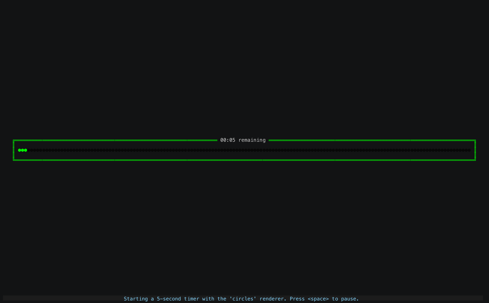

<p align="center">
  <br>
	<h1></h1>

<p align="center">Typescript app with multiple visual countdown timers</p>

<p align="center">
  <a href="#about">About</a> •
  <a href="#about">About</a> •
  <a href="#about">About</a> •
  <a href="#about">About</a> •
</p>

<p align="center">

</p>

## About Pace
Pace is a Typescript app that performs a countdown timer using a visual renderer on the command line. 
Choose a renderer when you run the app, or run preview to see a representation of all the renderers.

## Usage
```sh
USAGE
  $ pace timer [DURATION] [RENDERER]

ARGUMENTS
  DURATION  duration in (m)inutes and (s)seconds (eg 3m10s = 190 seconds)
  RENDERER  the timer renderer:
            bar, bigtext, circles, colorwheel, colossal, pie, renderers, shuffle, slant, sweep

DESCRIPTION
  Displays a progress timer

EXAMPLES
  $ pace timer 2.5m pie
```

### Preview All Renderers
```sh 
pace tools preview
```


## Contributing
It would be great to see more renderers! To write a new renderer add a subclass of `src/renderers/TimerRenderer` and register it with
a short name in `src/renderers/AllRenderers`. 

### Preview All Available Figlet Fonts
```sh 
pace tools allfonts
```

### Preview All Available Colors and Gradients
```sh 
pace tools colorblocks
```

### Notes
* Renderers should not store state between callbacks, since the `shuffle` renderer and `tools preview` command depend on calling renderers at selected intervals.

## Built With
* Typescript
* Yarn
* Oclif


